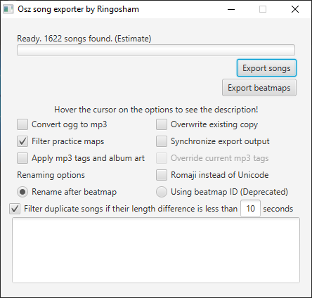

# Osz song exporter
A simple utility for exporting all songs and beatmaps (in .osz form) with a single click from your osu! library.



I find it funny that most of these utility software I found in GitHub either don't work or lacking in features. So I decided to make one myself!
## Disclaimer
This program only copies, and depending on the settings made by the user, converts and modifies the ID3 tags of songs that are already stored the user's (The individual operating this program) computer. The copied and/or modified files are stored in the user's device only. These songs are intended for personal use only and can be manipulated by the user in any way they wish. The author of this program cannot prevent the user from performing any copyright infringing actions with the files produced by the program. Therefore, in no event shall the author be liable for any copyright infringement claims. The user should only use these files under the confines of copyright laws.

This program, although it requires the rhythm game "Osu!" to function, it is not affiliated with the person/company developed the game.

In short,

Do not use this program for distributing songs illegally. The creator of this program is not responsible for such actions performed by the user of the program. 
## Features
* Export all beatmaps as .osz or just the songs
* Proper file renaming (or rename it after beatmap ID if you really want to)
* Adding MP3 tags based on beatmap info
* Filters!
    * Practice songs
    * By song length (Skip any ~60 second farm maps. Unless you really like hearing haitai)
    * Similar songs with the same names to prevent duplicates (Extremely useful for saving space and if you have a large amount of beatmaps) 
* Conversion from ogg to mp3 (Conversion is done via FFmpeg, included in the program)
* osu library synchronisation if you frequently update your song library

The above features are fully configurable!
## Building

This project now uses Maven instead of the old IntelliJ-specific build setup.

### Requirements

* Java 17 or newer
* Maven 3.9 or newer

### Commands

To run the app from source
```bash
mvn javafx:run
```

Platform packaging is done per target OS (for JavaFX natives):

```bash
# on Linux runner
mvn -Plinux64 clean package

# on Windows runner
mvn -Pwin64 clean package

# on macOS runner
mvn -Pmacos clean package
```

### Packaged outputs

Produces:

* `target/osz-song-exporter-1.0.jar` - jar without dependencies
* `target/osz-song-exporter-1.0-standalone-linux64.jar` - standalone jar for Linux x64
* `target/osz-song-exporter-1.0-standalone-win64.jar` - standalone jar for Windows x64
* `target/osz-song-exporter-1.0-standalone-macos.jar` - standalone jar for macOS arm64

Run the bundled jar with:

```bash
java -jar target/osz-song-exporter-1.0-standalone-linux64.jar
```

## Download
Go to the [release](https://github.com/ringosham/Osu-Exporter/releases) tab.

## Things to note
Depending on how many beatmaps you have, the process may take from less than 30 seconds to more than 5 minutes.

This program is only tested in Windows 64-bit, but it should work on all Linux distributions and macOS

## License
```
Copyright (C) 2026 Ringo Sham

This program is free software: you can redistribute it and/or modify
it under the terms of the GNU General Public License as published by
the Free Software Foundation, either version 3 of the License, or
(at your option) any later version.

This program is distributed in the hope that it will be useful,
but WITHOUT ANY WARRANTY; without even the implied warranty of
MERCHANTABILITY or FITNESS FOR A PARTICULAR PURPOSE.  See the
GNU General Public License for more details.

You should have received a copy of the GNU General Public License
along with this program.  If not, see <https://www.gnu.org/licenses/>.
 ```
## Dependencies

[JAVE2](https://github.com/a-schild/jave2) - Java Audio Video Encoder wrapper for FFmpeg - Under GNU GPL v3 license

[FFmpeg project](https://ffmpeg.org) - FFmpeg project - Cross platform record, stream, convert video and audio utility - [FFmpeg license](https://ffmpeg.org/legal.html)

[JavaFX AsyncTask](https://github.com/victorlaerte/javafx-asynctask) - AsyncTask in JavaFX - Under Apache License 2.0

[mp3agic](https://github.com/mpatric/mp3agic) - Java library for reading/manipulating ID3 tags - Under MIT License
